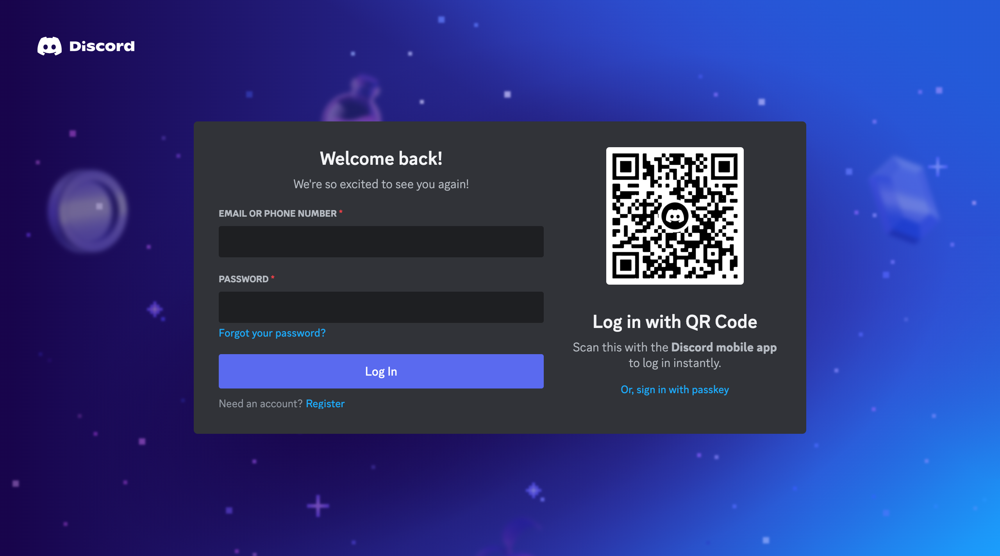

# Discord Login Page Clone

A perfect clone of the Discord login page built using HTML, CSS, and JavaScript.



## Features

- **Accurate UI**: An exact clone of the Discord login page.
- **Qr Code Refresh**: *Simulation* of QR Code refresh with same smooth animations just like in original vesion.
- **Clean Code**: Well-structured and commented code for easy understanding.

## Installation

1. **Clone the repository:**
    ```sh
    git clone https://github.com/Ayanprogrammer11/discord-login-page-clone.git
    cd discord-login-page-clone
    ```

2. **Open the `index.html` file in your browser:**
    ```sh
    open index.html
    ```

## Usage

1. **Open the project in your favorite code editor:**
    ```sh
    code .
    ```

2. **Modify the files as needed to fit your project requirements.**

## Screenshots


## Contributing

1. **Fork the repository:**
    Click the "Fork" button at the top right of this page.

2. **Create a branch:**
    ```sh
    git checkout -b feature/your-feature-name
    ```

3. **Commit your changes:**
    ```sh
    git commit -m 'Add some feature'
    ```

4. **Push to the branch:**
    ```sh
    git push origin feature/your-feature-name
    ```

5. **Open a pull request:**
    Click the "New Pull Request" button on your fork's GitHub page.

## License

This project is licensed under the MIT License - see the [LICENSE](LICENSE) file for details.

## Contact

- **Author**: Ayan Liaqat
- **GitHub**: [@Ayanprogrammer11](https://github.com/Ayanprogrammer11)
- **LinkedIn**: [@ayan-liaqat-5259882b4](https://www.linkedin.com/in/ayan-liaqat-5259882b4/)

## Acknowledgements

- Inspired by the original [Discord login page](https://discord.com/login).


**Disclaimer:** This project is not affiliated with, endorsed by, or connected to Discord in any way. It is purely a clone for educational purposes.

