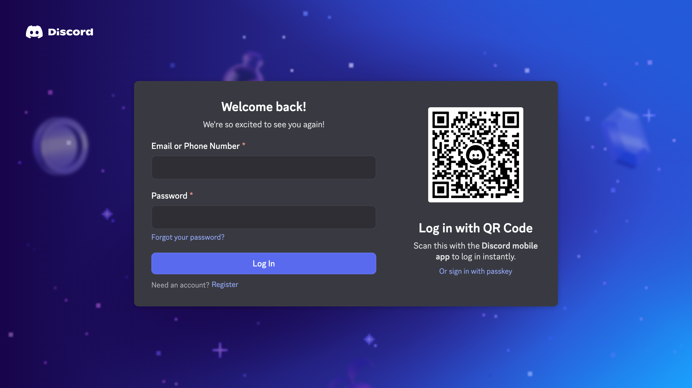

# Discord Login Page Clone

> A pixel-perfect recreation of Discord's login interface with animated interactions and clean, modern code architecture.

<div align="center">


[](https://opensource.org/licenses/MIT)
[](http://makeapullrequest.com)
[](https://github.com/Ayanprogrammer11/discord-login-page-clone/stargazers)

[View Demo](https://discord-cl.netlify.app/) · [Report Bug](https://github.com/Ayanprogrammer11/discord-login-page-clone/issues) · [Request Feature](https://github.com/Ayanprogrammer11/discord-login-page-clone/issues)

</div>

---

## 📸 Preview

## 🆕 Version 2.0

**Everything has been updated to match the Discord login page exactly yet again!** This update includes:

- **Refined color palette** – Updated to match Discord's latest design system
- **Enhanced input styling** – Modern rounded corners (8px), improved borders, and focus states
- **Improved typography** – Updated font weights, sizes, and line heights for better accuracy
- **Better form labels** – Changed from uppercase to proper case for improved readability
- **Polished UI details** – Refined spacing, padding, and visual consistency

## 📸 Side-by-Side Comparison

<div align="center">
  <table>
    <tr>
      <td align="center">
        <strong>Clone</strong><br/>
        
      </td>
      <td align="center">
        <strong>Original Discord Login</strong><br/>
        
      </td>
    </tr>
  </table>
</div>

## 🔥 Features

- 🎯 **Pixel-perfect UI** – Faithfully replicates Discord’s login page layout and design.
- 🔁 **Animated QR Code Refresh** – Simulates the QR refresh behavior with smooth animations.
- 🧼 **Clean, Commented Code** – Easy to read and modify for learning or reuse.

## 🚀 Installation

1. **Clone the repository**

   ```bash
   git clone https://github.com/Ayanprogrammer11/discord-login-page-clone.git
   cd discord-login-page-clone
   ```

2. **Open in your browser**

   **Windows:**

   ```bash
   start index.html
   ```

   **macOS:**

   ```bash
   open index.html
   ```

   **Linux:**

   ```bash
   xdg-open index.html
   ```

That's it! No build process, no dependencies to install. Just open and run.

## 🛠️ Development

### Project Structure

```
discord-login-page-clone/
├── assets/
│   ├── fonts/
│   │   └── ggsans/          # Discord's custom font
│   ├── bg.svg               # Background gradient
│   ├── login-screen-logo.svg
│   └── qrcode-discord-logo.png
├── css/
│   ├── index.css            # Variables and base styles
│   └── main.css             # Component styles
├── js/
│   └── script.js            # Modular JavaScript
├── index.html
└── README.md
```

### Key Components

**QRCodeModule** - Handles QR code generation and refresh logic

```javascript
QRCodeModule.generate(data); // Generate QR code
QRCodeModule.refresh(); // Refresh with new code
QRCodeModule.initRefreshInterval(); // Start auto-refresh
```

**LoginButtonModule** - Manages login button animations

```javascript
LoginButtonModule.showLoading(); // Show loading state
LoginButtonModule.reset(); // Reset to default
LoginButtonModule.init(); // Initialize event listeners
```

### Customization

#### Change QR Refresh Interval

```javascript
// In js/script.js
const CONFIG = {
  QR_REFRESH_INTERVAL: 120000, // Change this value (in milliseconds)
};
```

#### Modify Colors

```css
/* In css/index.css */
:root {
  --btn-bg: rgb(88, 101, 242); /* Button color */
  --btn-bg-hover: rgb(71, 82, 196); /* Button hover */
  --link-color: oklab(...); /* Link color */
}
```

## 📚 Learning Resources

This project is perfect for learning:

- **HTML5 Semantic Structure** - Proper use of forms, sections, and accessibility
- **CSS Custom Properties** - Dynamic theming with CSS variables
- **Modern JavaScript** - ES6+ features, modules, and best practices
- **SVG Manipulation** - Generating and modifying SVG elements
- **Animation Techniques** - CSS keyframes and JavaScript timing

## 🤝 Contributing

Contributions are what make the open-source community amazing! Any contributions you make are **greatly appreciated**.

1. Fork the Project
2. Create your Feature Branch (`git checkout -b feature/AmazingFeature`)
3. Commit your Changes (`git commit -m 'Add some AmazingFeature'`)
4. Push to the Branch (`git push origin feature/AmazingFeature`)
5. Open a Pull Request

### Contribution Ideas

- [ ] Add dark/light theme toggle
- [ ] Implement form validation
- [ ] Add password strength indicator
- [ ] Create mobile-responsive version
- [ ] Add more animation effects
- [ ] Improve accessibility (ARIA labels)
- [ ] Add unit tests

## 📝 License

This project is licensed under the MIT License - see the [LICENSE](LICENSE) file for details.

## 👨‍💻 Author

**Ayan Liaqat**

- GitHub: [@Ayanprogrammer11](https://github.com/Ayanprogrammer11)
- Project Link: [https://github.com/Ayanprogrammer11/discord-login-page-clone](https://github.com/Ayanprogrammer11/discord-login-page-clone)

## 🙏 Acknowledgements

- Inspired by [Discord's Login Page](https://discord.com/login)
- [qrcode-generator](https://www.npmjs.com/package/qrcode-generator) for QR code generation
- Discord's design team for the beautiful UI

## 📊 Stats


---

<div align="center">

### ⚠️ Important Disclaimer

This project is **NOT affiliated with, endorsed by, or connected to Discord Inc.** in any way.

It is a **frontend clone created purely for educational and non-commercial purposes** to demonstrate web development skills.

**DO NOT use this for:**

- Phishing or impersonation
- Collecting user credentials
- Any malicious activities

Using this project for illegal purposes is **unethical and illegal**.

---

**If you found this project helpful, please consider giving it a ⭐!**

Made with ❤️ by [Ayan Liaqat](https://github.com/Ayanprogrammer11)

</div>
