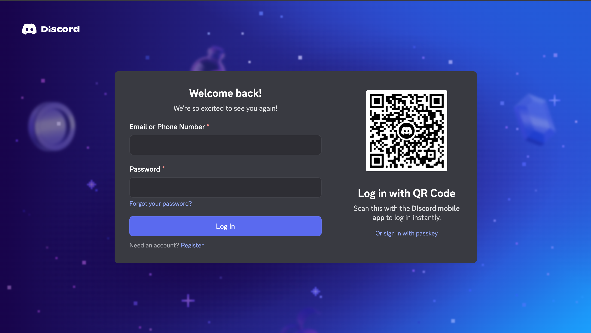

# Discord Login Page Clone

A pixel-perfect clone of the Discord login page built using HTML, CSS, and JavaScript.



## 🔥 Features

- 🎯 **Pixel-perfect UI** – Faithfully replicates Discord’s login page layout and design.
- 🔁 **Animated QR Code Refresh** – Simulates the QR refresh behavior with smooth animations.
- 🧼 **Clean, Commented Code** – Easy to read and modify for learning or reuse.

## 🚀 Installation

1. **Clone the repository:**
   ```sh
   git clone https://github.com/Ayanprogrammer11/discord-login-page-clone.git
   cd discord-login-page-clone
   ```

2. **Open the `index.html` file in your browser:**

   * On **Windows**:

     ```sh
     start index.html
     ```

   * On **macOS**:

     ```sh
     open index.html
     ```

   * On **Linux**:

     ```sh
     xdg-open index.html
     ```

## 🛠️ Usage

1. **Open the project in your favorite code editor:**

   ```sh
   code .
   ```

2. **Customize or experiment with the code as needed.**
   Feel free to use it as a learning resource or UI reference.

## 🌟 Contributing

1. **Fork the repository**
   Click the “Fork” button on the top right.

2. **Create a feature branch:**

   ```sh
   git checkout -b feature/your-feature-name
   ```

3. **Commit your changes:**

   ```sh
   git commit -m 'Add some feature'
   ```

4. **Push the branch:**

   ```sh
   git push origin feature/your-feature-name
   ```

5. **Open a pull request** on GitHub.

## 📄 License

This project is licensed under the MIT License – see the [LICENSE](LICENSE) file for details.

## 👤 Author

* **Name**: Ayan Liaqat
* **GitHub**: [@Ayanprogrammer11](https://github.com/Ayanprogrammer11)

## 🙌 Acknowledgements

* Inspired by the original [Discord Login Page](https://discord.com/login)

---

> ⚠️ **Disclaimer**
> This project is **not affiliated with, endorsed by, or connected to Discord** in any way.
> It is a **frontend clone made purely for educational and non-commercial purposes.**
> Do not use it for phishing or impersonation — doing so is unethical and illegal.

```
